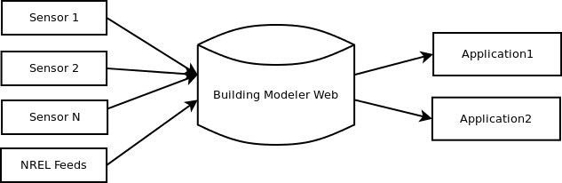

Smartgrid Website API Version 1
===============================

Joseph Lewis <joehms22@gmail.com>

2013-03-20

Introduction
============

The smartgrid website provides a powerful API for developers wanting to build
applications that utilize the vast amounts of data stored within it's confines.
As of the time of this writing, the data store is collecting over a million new
points of data every day.

There are a few things to note before using the application:

* The web store can only be accessed from within the DU network.
* Applications will be automatically throttled/dropped if they attempt to use
too many server resources.^[If you need more requests, contact a developer and
they'll likely grant you more.]
* There are three different kinds of API Keys
	+ _User_
	These keys are used for doing everything the user can do, programatically. You
	can automate standard tasks from scripts in this manner (like updating all 
	of your application keys.)
	+ _Project_
	These keys are used for applications looking to fetch data from the site. They
	are what you'd use for most apps.
	+ _Device_
	These are special keys that operate over one or more feeds that allow a device
	to submit new points to these feeds.

When Not To Use the API
-----------------------

* **If you want the entire history of a feed**, this is available as compressed 
csv files that you can find on a feed's description page; these are much more 
complete records.

Architecture
------------

Overall, the Smartgrid website is made up of three major components:

* *Devices*
Devices are the programs or electronic componenets that notify the web store of
new data values.
* *Data Store*
The data store is the component that allows users to create new feeds and 
devices.
* *Fetchers*
These are the projects that make sense of the data in the data store. Fetchers
could potentially be Devices as well, but it is unlikely this would be an
entirely desireable thing.

The Device API
==============

In the following examples, BASE_URL should be replaced by the URL of the server,
most likely "http://smartgrid.cs.du.edu". The properties in angled brackets 
should be replaced with their respective variables.

`DEV_NAME` Is the human readable name of a device.

`USER_KEY` Is the key that is associated with your user account.

`DEV_KEY` Is the key that the device uses to connect with the server, 
se the section: "Get the Key for a Device" on how to get it.

`FEED_ID` Is the id number of a feed; from the web store, if you look at the 
URL while you are viewing any feed, you can see the feed id after the 'feed'
part of the URL: "http://smartgrid.cs.du.edu/feed/**1479**/"

-------------------------------------------------------------------------------------------------------------------------
Action					URL													Return
------------------		--------------------------------------------------  ---------------------------------------------
Create a Device			/device/api/1/create/DEV_NAME/USER_KEY/				Device Key on success, error on failure.

Enable a Device			/device/api/1/enable/DEV_KEY/USER_KEY/				4XX error on failure.

Disable a Device		/device/api/1/disable/DEV_KEY/USER_KEY/				4XX error on failure.

Check if a Device		/device/api/1/enabled/DEV_KEY/						True if enabled, False if otherwise/error
is Enabled

Check if a user			/device/api/1/owned_by/DEV_KEY/USER_KEY/			True if owned by user, False if otherwise/error.
owns a device

Get a device's key		/device/api/1/get_key/DEV_NAME/USER_KEY/			The key for the device or a 4xx code on error.

Check if device can		/device/api/1/on_feed/DEV_KEY/FEED_ID/				True if can, False if otherwise/error
submit to feed.

Allow device to 		/device/api/1/add_feed/DEV_KEY/FEED_ID/USER_KEY/	4XX error on failure
submit to feed.

Disallow device to 		/device/api/1/remove_feed/DEV_KEY/FEED_ID/USER_KEY/	4XX error on failure
submit to feed.
--------------------------------------------------------------------------------------------------------------------------

The Feed API
============

All of the methods listed below **require** an API key as either part of a GET 
or a POST request, passed in under the parameter name "key" e.g.:

	http://smartgrid.cs.du.edu/feed/api/1/list_all/csv/?key=<INPUT KEY HERE>

The only methods below that do not require this, are those that require a 
User or Device key.

Currently, there is a limit on the number of requests that you can make per day 
with a given API key; it is thus expected that you do a good job managing your
data, making a few requests, and caching data.

If you need more data, send an email to one of the developers with your request,
and they will likely afford you more.

Listing the Available Feeds
---------------------------

To find all the feeds that are available to fetch, call the following function:

	BASE_URL/feed/api/1/list_all/csv/

Note that ?key= authentication is required.

Locating a Feed
---------------

If you know the name of a feed, but don't know the id of that feed; find it 
using the following function:

	BASE_URL/feed/api/1/lookup/<Feed Name>/

Note that ?key= authentication is required; alternately, a user-id may be used
as a key if it is put under the GET or POST parameter "user" e.g.
	
	http://smartgrid.cs.du.edu/feed/api/1/lookup/<Feed Name>/?user=USER_KEY
	

Creating a Feed
---------------

In order to have a device submit a feed, one must be created. This method 
creates the feed with the given name, and returns the id for the feed.

	BASE_URL/feed/api/1/create/<Feed Name>/USER_KEY/

If the user key is invalid, a 4XX error will be returned by the server.

Deleting a Feed
---------------

To suggest the deletion of a feed, call the following method. Note that the
server does not need to obey this request, as doing so may cause stability 
issues with software that needs the feed to exist in order to run.

	BASE_URL/feed/api/1/delete/FEED_ID/USER_KEY/

If the user key is invalid, a 4XX error will be returned by the server.

Finding the Value of a Feed
---------------------------

There are three different ways to find the value of a feed; as a special param
to each of these, `<Date>` is introduced.

It is a date in one of the following formats:

* `YYYY-MM-DD HH:MM:SS` Assumed to be in the current Mountain Time
* `YYYY-MM-DDTHH:MM:SS` Same as above, but uses T as a seperator instead of a space.
* `YYYY-MM-DDTHH:MM:SSZ` A date in UTC.
* `YYYY-MM-DDTHH:MM:SS+00:00` A date in UTC and an offset.

_Each of these is a derivative of ISO 8601._
_If at all possible, you should try to use the third format._

**Finding a Single Value**

To find a single value, call the following method:

	BASE_URL/feed/api/1/closest/FEED_ID/<Range>/<Date>/

It will find the closest data point within the given range 
(from 1 to 180, in minutes). If no point exists, `null` is returned.

_Example_
_The following URL will find the closest value to 2012-01-01T01:02:03Z for feed_
_4920 within a range of 60 minutes:_

	http://smartgrid.cs.du.edu/feed/api/1/closest/4920/60/2012-01-01T01:02:03Z/?key=API_KEY

**Finding Multiple Values**

This is similar to the previous example, except you are able to request multiple
values through the use of GET or POST params:

	BASE_URL/feed/api/1/closest/FEED_ID/<Range>/<Format>/
	
In this case, you would append one or more `d` parameters to the request, it is
probably best to do a POST with these as they may take up more space than the
URL allows.

The Parameter <Format> can either be `csv` or `json`, both of which will return
the date (in the format you requested it) and the value for that date or `null` 
if no value can be found within the range.

If at all possible, we request that you cache your results from these rather 
hefty queries.

_Example:_

	http://smartgrid.cs.du.edu/feed/api/1/closest/139/180/json/?d=2012-11-26 02:00:00&d=2012-11-26 02:00:00&key=API_KEY

_Output:_
	{"2012-11-26 02:00:00": 0.0, "2012-11-26 01:00:00": 1.0}

If the <Format> variable is `json` you may optionally specify a variable named
`jsonp`. The value of this variable will wrap around the returned output. In 
this manner you can get around the browser same-origin policy.

**Finding All Values Between Two Dates**

If you want to find all of the values between two dates, use the following API:

	BASE_URL/feed/api/1/all/FEED_ID/<Format>/<Start Date>/<End Date>/
	
It will return the values in a compressed format (JSON Shown):

URL:

	http://smartgrid.cs.du.edu/feed/api/1/all/139/json/2012-11-26 00:00:00/2012-11-26 02:00:00/?key=APIKEY

Output:

	{"points":[
	  {
		"start": "2012-11-26 07:00:00+00:00",
		"end": "2012-11-26 07:30:00+00:00",
		"value": 0.0
	  },
	  {
		"start": "2012-11-26 08:00:00+00:00",
		"end": "2012-11-26 08:00:00+00:00",
		"value": 1.0
	  },
	  {
		"start": "2012-11-26 09:00:00+00:00",
		"end": "2012-11-26 09:00:00+00:00",
		"value": 0.0
	  }
	]}

Such that the values for the feed will appear as the given value between the two
dates.

If the <Format> variable is `json` you may optionally specify a variable named
`jsonp`. The value of this variable will wrap around the returned output. In 
this manner you can get around the browser same-origin policy.

Submitting Values for a Feed The Easy Way
-----------------------------------------

If you are looking to create devices that do not need the user's
permission to create the feeds they are going to post on, there is a
quick and easy way of doing it:

	/feed/api/1/submit_and_create/

This API method takes two params via GET or POST:

	device - The device ID to post as.
	feed - A string representing a feed name to post the data to

If a feed with the given name does not yet exist, one is created, added
to the user's account, and assigned to the device all in one go.

If a feed with the given name does exist, and the device is not the owner,
an error message is returned:

	Must define valid `device` and `feed` GET params

Then, all you need to do is pass in the data in the following format, up to 1000 points:

	d1 - the ISO date for the first data pair
	v1 - the value for the first data pair
	...
	dn - the ISO date for the nth data pair
	vn - the vaue for the nth data pair

NOTE: You MUST begin with the number 1, and if you skip any numbers, the submission will be 
terminated.

Example:

	device=some-long-uuid-here
	feed=FeedName
	d1=2012-06-01 01:02:03
	v1=234.13
	d2=2012-06-01 01:03:03
	v2=234.54

Submitting Values for a Feed The Hard Way
-----------------------------------------

To submit values for a feed, make a POST request to the following URL:

	BASE_URL/feed/api/1/submit/DEV_KEY/

To which, append the following parameters:

* _d1_ -- The date for the first set of data
* _v1_ -- The value for the first set of data
* _f1_ -- The feed for the first set of data

You may submit up to one thousand points of data at a time, incrementing
the numbers followed by `d`,`v`,`f`.

Example:

	http://smartgrid.cs.du.edu/feed/api/1/submit/DEVICE_KEY/

POST Params:

	d1=2012-06-01 01:02:03
	v1=234.13
	f1=124
	d2=2012-06-01 01:03:03
	v2=234.54
	f2=124

You MAY submit data points for different feeds, if and only if those feeds are
associated with the device for which the key is valid.

The server will terminate as soon as it finds a feed that does not belong to the
given device. This means your data will be saved up until that point, but no
further.

The server WILL terminate as soon as one of the expected is not found in the 
POST statement. Therefore in order to successfully submit points a client MUST
start with index 1 and increment numbers by one.

Compressing a Feed
-------------------

**Note** This behavior is only a suggestion to the server, and probably won't 
work under normal circumstances due to the large amount of resources it takes
to accomplish.

	BASE_URL/feed/api/1/compress/FEED_ID/

Setting the Description of a Feed
---------------------------------

	BASE_URL/feed/api/1/set_description/FEED_ID/USER_KEY/?descripton=<DESCRIPTION>

If the user key is invalid, a 4XX error will be returned by the server.

Getting the Description of a Feed
---------------------------------

	BASE_URL/feed/api/1/get_description/FEED_ID/
	
Note that ?key= authentication is required.

The Project API
===============

-------------------------------------------------------------------------------------------------------
Action					URL													GET Params
------------------		-----------------------------------------------		---------------------------
Send a message			/project/api/1/notify/								?key - the project key;
to project members 															?message - message to send

-------------------------------------------------------------------------------------------------------

Changelog
=========

* 2012-12-04 - Added Setting/Getting descriptions of feeds, added user 
authentication to getting a feed id from a name.
* 2013-03-20 - Added project API notifications.
